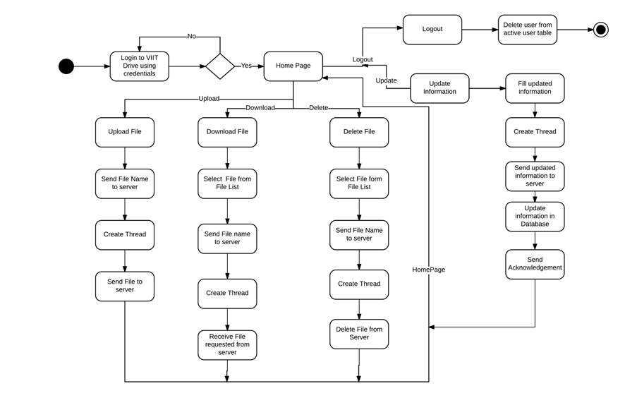
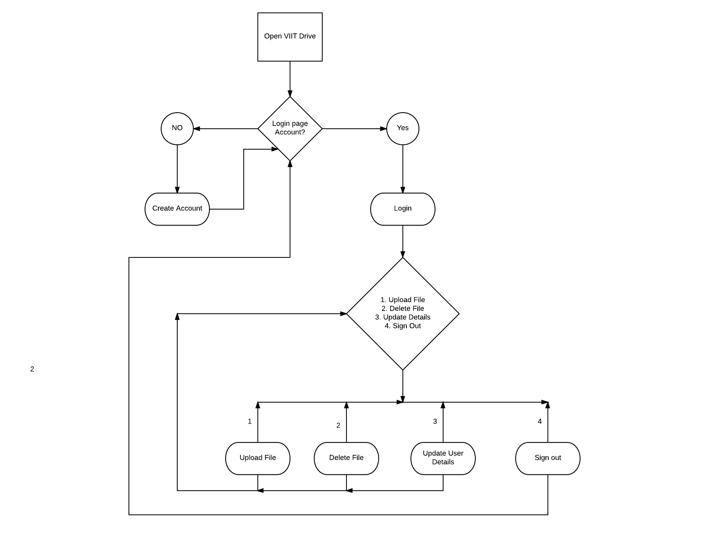

# College-Drive based on Java

Drive for college that works on a network in college campus.
Students can upload and download their personal files through their accounts.
This project covers the concepts of multi-threading,socket programming,file handling and Swing for GUI.

